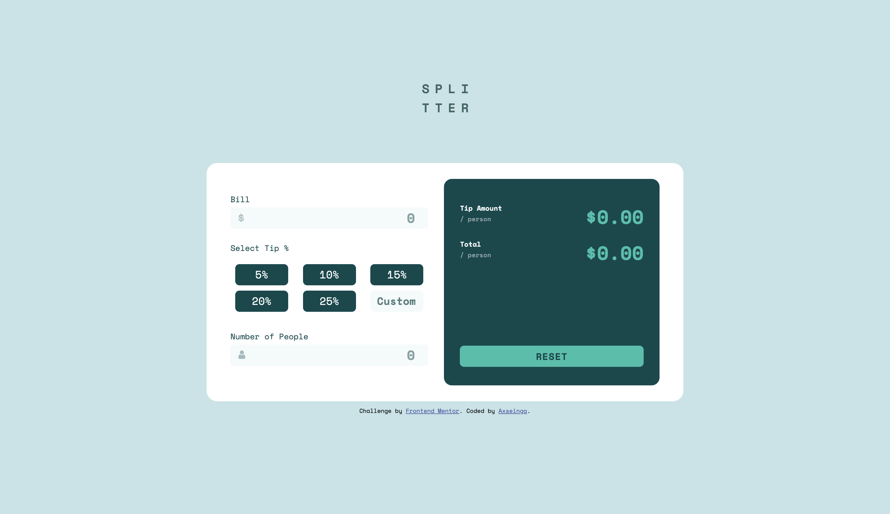
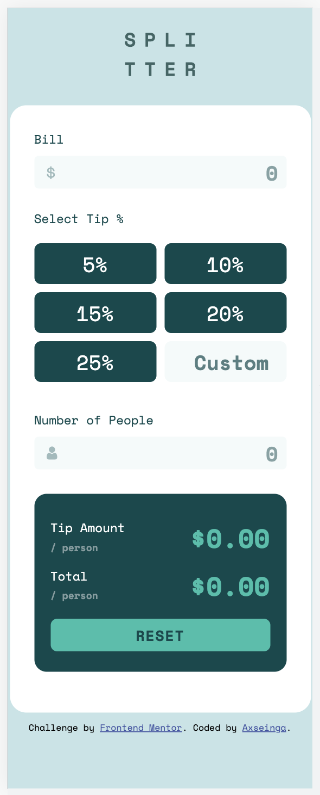

# Frontend Mentor - Tip calculator app solution

This is a solution to the [Tip calculator app challenge on Frontend Mentor](https://www.frontendmentor.io/challenges/tip-calculator-app-ugJNGbJUX). Frontend Mentor challenges help you improve your coding skills by building realistic projects.

## Table of contents

-   [Overview](#overview)
    -   [The challenge](#the-challenge)
    -   [Screenshot](#screenshot)
    -   [Links](#links)
-   [My process](#my-process)
    -   [Built with](#built-with)
    -   [What I learned](#what-i-learned)
    -   [Continued development](#continued-development)
    -   [Useful resources](#useful-resources)
-   [Author](#author)
-   [Acknowledgments](#acknowledgments)

## Overview

### The challenge

Users should be able to:

-   View the optimal layout for the app depending on their device's screen size
-   See hover states for all interactive elements on the page
-   Calculate the correct tip and total cost of the bill per person

### Screenshot

### Links

-   Solution URL: [See how I code it](https://github.com/axseinga/tip-calculator-app)
-   Live Site URL: [See live site here](https://axseinga-tip-calculator-app.netlify.app/)

## My process

### Built with

-   Semantic HTML5 markup
-   CSS custom properties
-   SASS & Dart
-   BEM pattern
-   Flexbox
-   CSS Grid
-   Mobile-first workflow
-   Webpack
-   Javascript
-   JS modules
-   JS Classes

### What I learned

I decided to use [Webpack](https://webpack.js.org/) (which is a module bundler) for this project. This is my first one where I have done Webpack configuration all by myself (with some help of my Mentor, shoutout in credits!). Before that I used [Babel](https://babeljs.io/) for my projects. It is said Babel is much easier to install and to use than Webpack because, as I mentioned before, Webpack requires the user to get this sneaky configuration done, before even starting to code.

So for anyone interested you can take a look at the [config file](https://github.com/axseinga/tip-calculator-app/blob/main/webpack.config.js).
To use Webpack you need to first download [npm](https://www.npmjs.com/package/webpack) and install it along with [webpack Command Line Interface](https://webpack.js.org/api/cli/). As mentioned before, to use Webpack we need to config it in webpack.config.js. To use developer mode I needed to get [DevServer](https://webpack.js.org/configuration/dev-server/). Alright, ready to code! So I thought. But I still needed to get a compiler - so I got [babel-core](https://www.npmjs.com/package/@babel/core), [babel/preset-env](https://babeljs.io/docs/en/babel-preset-env) and [babel-loader](https://webpack.js.org/loaders/babel-loader/) so all those new syntax can be understood by older browsers. Oh, and then I needed to get something that will copy my index.html file and add all those js files so I got [HTML Webpack Plugin](https://webpack.js.org/plugins/html-webpack-plugin/). In the middle of the project, I realized my source map is not correct (command lines in google tools didn't match those in my VSCode) so for this problem, I got [Source map loader](https://webpack.js.org/configuration/devtool/). Oh, and if you need your image file to be copied to the production file I can recommend getting [Copy Webpack Plugin](https://webpack.js.org/plugins/copy-webpack-plugin/).

Alright! So I am done with describing HTML & JS part, let's move to compiling styles. Because I wanted to use SASS modules feature which is not supported by the old version of npm sass I had to get [Dart Sass](https://sass-lang.com/dart-sass). @import in SASS will not be supported in the future so it is good to get a grip on Dart Sass already. To connect SASS files I used [Sass loader](https://webpack.js.org/loaders/sass-loader/). For from SASS to CSS compilation I used [CSS loader](https://webpack.js.org/loaders/css-loader/) and recommended [CSS loader](https://webpack.js.org/loaders/style-loader/). Phuh, easy-peasy! For everyone who needs a shortcut, I can recommend getting [Laravel Mix](https://laravel-mix.com/docs/6.0/installation) which is a simple, fluent API for dynamically constructing Webpack configuration. But for me this time it was extremely important to get to know Webpack on a good level.

In this project, I wanted as well use Javascript Classes. I had some experience using them but felt like I need some practice to get a better understanding of this concept.

### Continued development

I am planning to move to testing and React and then start coding projects from Frontend Mentor in React framework.

### Useful resources

-   [Webpack](https://webpack.js.org/) - All documentation for webpack that might be needed while using it.
-   [How to configure Webpack from Scratch for a basic website](https://dev.to/antonmelnyk/how-to-configure-webpack-from-scratch-for-a-basic-website-46a5) - Very good article to start from when configuring Webpack for a project. Unfortunately, it does not cover Dart Sass as the article was written at the beginning of 2019.
-   [Dart Sass](https://sass-lang.com/dart-sass) - documentation.
-   [Stop using @import with Sass | @use and @forward explained](https://www.youtube.com/watch?v=CR-a8upNjJ0) - by Kevin Powell.
-   [Stackoverflow: Why before & after pseudo elements does not work on an input field](https://stackoverflow.com/questions/2587669/can-i-use-a-before-or-after-pseudo-element-on-an-input-field) - if anyone wonders.
-   [Customize radio buttons](https://markheath.net/post/customize-radio-button-css)

## Author

-   Github - [Axseinga](https://github.com/axseinga)
-   Frontend Mentor - [@Axseinga](https://www.frontendmentor.io/profile/axseinga)
-   LinkedIn - [@Agnieszka Urbanowicz](https://www.linkedin.com/in/agnieszka-urbanowicz-051147151/)

## Acknowledgments

Thanks to my [Mentor](https://devmentor.pl/) for helping me out with all Webpacks problems!
